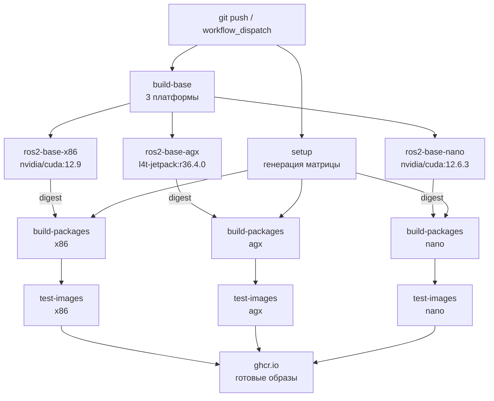
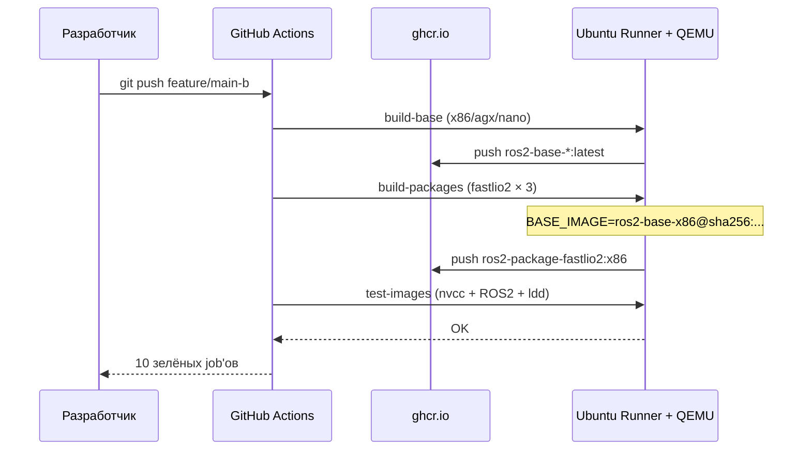

```markdown
# Архитектура системы

## Обзор

Система автоматической кросс-платформенной сборки Docker-образов для ROS2-пакетов
с CUDA. Три целевые платформы, единый CI/CD-пайплайн в GitHub Actions.

## Схема пайплайна







| Платформа | База | ROS2 | CUDA arch | Runner | Эмуляция |
| --- | --- | --- | --- | --- | --- |
| x86 | `nvidia/cuda:12.9.0-devel-ubuntu22.04` | Humble | 86 | `ubuntu-latest` | нет |
| agx | `nvcr.io/nvidia/l4t-jetpack:r36.4.0` | Humble | 87 | `ubuntu-latest` | QEMU |
| nano | `nvidia/cuda:12.6.3-devel-ubuntu24.04` | Jazzy | 87 | `ubuntu-latest` | QEMU |


### Кеширование
## Двухуровневое:

1. Registry cache (type=registry,mode=max) — переживает между прогонами,
шарится между ветками, но тянется по сети.

2. Local BuildKit cache через actions/cache — быстрее, но привязан
к конкретному runner'у.

Оба используются одновременно: cache-from: [local, registry],
cache-to: [local, registry]. Это даёт максимальный hit rate.

### Воспроизводимость

build-packages использует digest базового образа, а не мутабельный :latest.
Digest резолвится на лету через docker buildx imagetools inspect перед сборкой.
Это гарантирует, что пакет собран именно из той базовой версии, которая
существует на момент запуска, и не «уедет» при перезаписи :latest.

### Принятые решения
См. docs/adr/:

0001 — почему QEMU, а не нативный ARM-runner

0002 — почему Jazzy на Nano

0003 — почему CMake из Kitware APT