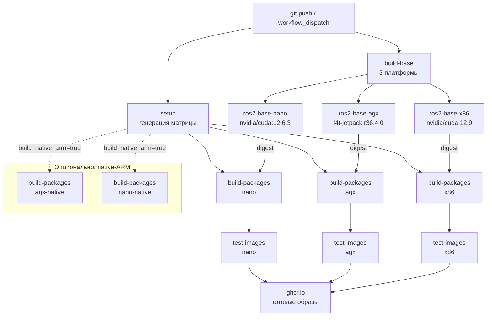
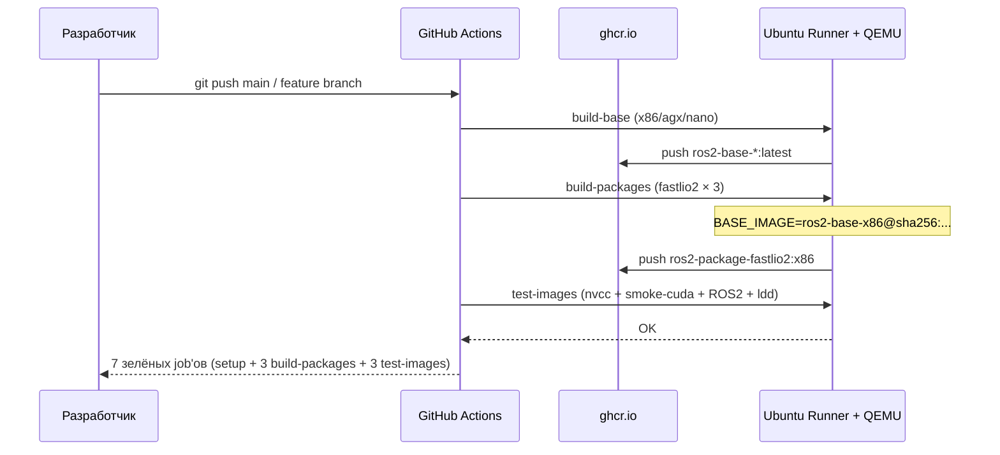

# Архитектура системы

## Обзор

Система автоматической кросс-платформенной сборки Docker-образов для ROS2-пакетов
с CUDA. Три целевые платформы, единый CI/CD-пайплайн в
[GitHub Actions](https://github.com/MindMaze74/ros2-cuda-crossbuild/actions).

| Компонент | Где лежит |
|---|---|
| Workflow сборки | [`.github/workflows/build.yml`](../.github/workflows/build.yml) |
| Workflow автогенерации README | [`.github/workflows/readme-sync.yml`](../.github/workflows/readme-sync.yml) |
| Список пакетов | [`config/packages.yaml`](../config/packages.yaml) |
| Базовые Dockerfile | [`docker/Dockerfile.base.*`](../docker/) |
| Шаблон сборки пакета | [`docker/Dockerfile.package`](../docker/Dockerfile.package) |
| Развёртывание | [`docs/DEPLOYMENT.md`](DEPLOYMENT.md) |
| Итоговый отчёт | [`docs/REPORT.md`](REPORT.md) |
| Принятые решения | [`docs/adr/`](adr/) |

---

## Схема пайплайна



## Поток данных



---

## Таблица платформ

| Платформа | База | ROS2 | CUDA arch | Runner | Эмуляция |
|---|---|---|---|---|---|
| x86 | `nvidia/cuda:12.9.0-devel-ubuntu22.04` | Humble | 86 | `ubuntu-latest` | нет |
| agx | `nvcr.io/nvidia/l4t-jetpack:r36.4.0` | Humble | 87 | `ubuntu-latest` | QEMU |
| nano | `nvidia/cuda:12.6.3-devel-ubuntu24.04` | Jazzy | 87 | `ubuntu-latest` | QEMU |

Дополнительно (опционально, при наличии self-hosted Jetson-раннеров):

| Платформа | Runner | Тип сборки | Тег образа |
|---|---|---|---|
| agx | `[self-hosted, arm64, jetson-agx]` | нативная | `:agx-native` |
| nano | `[self-hosted, arm64, jetson-nano]` | нативная | `:nano-native` |

Инструкция по подключению раннеров — [`docs/DEPLOYMENT.md`](DEPLOYMENT.md), раздел 3.

---

## Пакеты в GHCR

| Образ | Ссылка |
|---|---|
| x86 base | [`ros2-base-x86`](https://github.com/MindMaze74?tab=packages&repo_name=ros2-cuda-crossbuild) |
| AGX base | [`ros2-base-agx`](https://github.com/MindMaze74?tab=packages&repo_name=ros2-cuda-crossbuild) |
| Nano base | [`ros2-base-nano`](https://github.com/MindMaze74?tab=packages&repo_name=ros2-cuda-crossbuild) |
| FAST-LIO2 x86 | [`ros2-package-fastlio2:x86`](https://github.com/MindMaze74?tab=packages&repo_name=ros2-cuda-crossbuild) |
| FAST-LIO2 agx | [`ros2-package-fastlio2:agx`](https://github.com/MindMaze74?tab=packages&repo_name=ros2-cuda-crossbuild) |
| FAST-LIO2 nano | [`ros2-package-fastlio2:nano`](https://github.com/MindMaze74?tab=packages&repo_name=ros2-cuda-crossbuild) |

Все образы публичные, доступны без аутентификации через `docker pull`.

---

## Кеширование

Двухуровневое:

1. **Registry cache** (`type=registry,mode=max`) — переживает между прогонами,
   шарится между ветками, но тянется по сети.
2. **Local BuildKit cache** через [`actions/cache@v4`](https://github.com/actions/cache)
   — быстрее, но привязан к конкретному runner'у.

Оба используются одновременно:

```yaml
cache-from: |
  type=local,src=/tmp/.buildx-cache
  type=registry,ref=ghcr.io/mindmaze74/ros2-cuda-crossbuild/ros2-base-${platform}:buildcache
cache-to: |
  type=local,dest=/tmp/.buildx-cache-new,mode=max
  type=registry,ref=ghcr.io/mindmaze74/ros2-cuda-crossbuild/ros2-base-${platform}:buildcache,mode=max
```

Это даёт максимальный hit rate: если local-кеш есть — читается моментально,
если нет — подтягивается registry.

---

## Воспроизводимость

`build-packages` использует **digest базового образа**, а не мутабельный
`:latest`. Digest резолвится на лету через `docker buildx imagetools inspect`
перед сборкой. Это гарантирует, что пакет собран именно из той базовой
версии, которая существует на момент запуска, и не «уедет» при перезаписи
`:latest` (например, если кто-то запустит `build_base=true` параллельно).

Реализация — в [`build.yml`](../.github/workflows/build.yml), шаг
`Resolve base image reference`.

---

## Безопасность

- **`permissions`** на уровне каждого job'а — least privilege
  (`contents: read`, `packages: write` только там, где пушим, `id-token: write`
  для OCI-attestations).
- **`GITHUB_TOKEN`** вместо долгоживущего PAT — токен живёт только на время прогона.
- **`provenance: false`** в `docker/build-push-action` — отключает SLSA-аттестации
  (для практики они не нужны, а их публикация — дополнительная точка отказа).
- **`LABEL org.opencontainers.image.source`** — привязка пакета к репозиторию,
  без неё GHCR создаёт «осиротевший» пакет и `GITHUB_TOKEN` не может в него писать.

---

## Принятые решения

См. [`docs/adr/`](adr/):

- [ADR-0001 — почему QEMU, а не только нативный ARM-runner](adr/0001-why-qemu.md)
- [ADR-0002 — почему Jazzy на Nano вместо Humble](adr/0002-why-jazzy-for-nano.md)
- [ADR-0003 — почему CMake из бинарного архива Kitware](adr/0003-why-kitware-apt.md)

Индекс всех ADR — [`docs/adr/README.md`](adr/README.md).

---

## Ссылки

- **Actions:** https://github.com/MindMaze74/ros2-cuda-crossbuild/actions
- **Packages:** https://github.com/MindMaze74?tab=packages
- **Issues:** https://github.com/MindMaze74/ros2-cuda-crossbuild/issues
- **PR с реализацией:** https://github.com/MindMaze74/ros2-cuda-crossbuild/pull/4